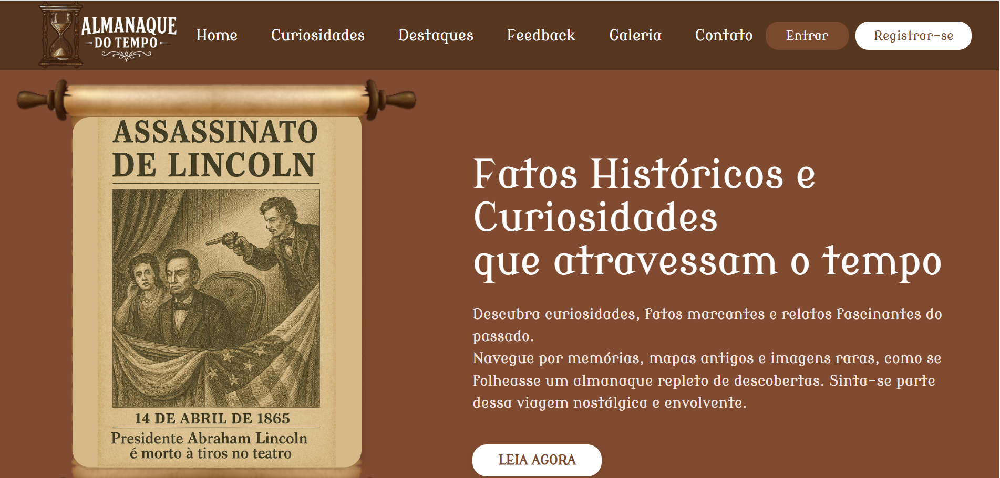

## Almanaque do Tempo




# 📰 Portal de Notícias Históricas e Curiosidades

Este é um sistema web de portal de notícias voltado para o ensino de História, permitindo o cadastro, edição, exclusão e exibição de notícias. Há também funcionalidades de login, painel administrativo, sistema de comentários, gerenciamento de usuários e recuperação de senha.

## 🔧 Tecnologias Utilizadas

- **PHP** (com PDO)
- **MySQL** (dump incluso)
- **HTML5 / CSS3**
- **JavaScript** (mínimo)
- **Composer** (para dependências)

## 📂 Estrutura de Pastas

```
portalNoticias/
│
├── admin/
│   ├── painel_admin.php
│   ├── remover_admin.php
│   └── tornar_admin.php
│
├── areaRestrita/
│   ├── editar_noticia.php
│   ├── excluir_noticia.php
│   ├── noticia.php
│   ├── nova_noticia.php
│   ├── perfil.php
│   └── uploads/
│
├── conexao/
│   ├── config.php
│   ├── conexao.php
│   ├── funcoes.php
│   └── verifica_login.php
│
├── crudAnunciante/
│   ├── cadastrar_anunciante.php
│   ├── editar_anunciante.php
│   ├── processar_anunciante.php
│   └── excluir_anunciante.php
|
├── crudUsuarios/
│   ├── atualizar_senha.php
│   ├── cadastro_usuario.php
│   ├── editar_usuario.php
│   └── excluir_usuario.php
│
├── script/
│   ├── scriptNovaNot.js
│   ├── scriptIndex.js
│   └── scriptEditNot.js
│  
├── crudFuncionario/
│   ├── cadastrar_funcionario.php
│   ├── editar_funcionario.php
│   ├── excluir_funcionario.php
│   └── processar_funcionario.php
|
├── styles/
│   ├── styles.css
│   ├── stylesCadFunc.css
│   ├── stylesCadUsu.css
│   ├── stylesContato.css
│   ├── stylesEditNot.css
│   ├── stylesIndex.css
│   ├── stylesLogin.css
│   ├── stylesNovaNoticia.css
│   ├── stylesPainelAdmin.css
│   ├── stylesPerfil.css
│   ├── stylesRecSenha.css
│   ├── stylesPolitica.css
│   ├── stylesTermos.css
│   ├── stylesVerifCod.css
|
├── vendor/
│   ├── composer.json
│   └── composer.lock
│
├── img/
│
├── dumpProjetoPortalNoticiaHistorica.sql
│
├── index.php
├── login.php
├── logout.php
├── recuperar_senha.php
├── verificar_codigo.php
├── contato.php
├── termos.php
└── politica.php
```

## ✅ Funcionalidades

👥 Autenticação
Cadastro de usuários comuns e administradores.
Login com sessões e cookies.

🧑‍💼 Painel do Admin
Listagem, edição e exclusão de:
Usuários
Funcionários
Notícias

🗞️ Publicação de Notícias
Criação com editor HTML (escolha de fonte, tamanho, imagens).
Edição de notícias existentes.
Comentários dos usuários.

📄 Perfil de Usuário
Atualização de nome, e-mail, telefone, sexo e senha.
Upload de imagem de perfil com visualização.
Requer senha antiga para trocar por uma nova.

## 🗃️ Estrutura do Banco de Dados

Tabelas principais:

usuarios: id, nome, email, senha, sexo, fone, is_admin, foto, codigo_autenticacao

noticias: id, titulo, noticia (HTML), imagem, data, autor (FK)

funcionarios: dados completos, incluindo CPF/CNPJ, nacionalidade, etc.

comentarios: id, noticia_id, usuario_id, comentario, data

## 📦 Instalação
Clone o repositório:

bash: git clone https://github.com/seuusuario/portal-noticias.git
Importe o banco de dados (portalnoticias_bd.sql) no phpMyAdmin ou via terminal.

Configure a conexão com o banco no arquivo:

php: ./conexao/config.php

## ▶️ Instruções para rodar

1. Instale o [XAMPP](https://www.apachefriends.org/index.html) ou similar
2. Coloque os arquivos do projeto em `htdocs/portalNoticias`
3. Importe o dump do banco no **phpMyAdmin**
4. Acesse `http://localhost/portalNoticias` pelo navegador

## 🙋‍♂️ Autores
Gabriel Costa Bock e Priscila Schlotenfeldt da Silva
Email: gabrielcostabock@gmail.com, priscilaschloten@gmail.com

